# Roamstead

## License

Copyright © 2026 Roamstead project owner. All rights reserved. This repository is source-available for review and hackathon evaluation; reuse, modification, distribution, or commercial use requires prior written permission. See [LICENSE](LICENSE). Third-party software, services, data, trademarks, and media retain their own licenses and terms.

## What this app is about

Roamstead is a collaborative decision partner for people trying to find an affordable home where they can retire abroad. I started it from a problem I feel personally: rising home prices and living costs have made it impossible for me to afford a home where I currently live. I wanted a practical way for my family and me to investigate whether another market could offer a realistic path to retirement without trusting incomplete listings or making a life-changing decision on price alone. I believe many other Americans facing the same pressure could find this kind of careful, evidence-backed guidance useful too.

Roamstead turns property pages, photographs, budgets, relocation constraints, and user feedback into a persistent, approval-gated decision process—not another chat window. It treats affordability as personal: the right home must fit the user's budget while also supporting healthcare access, daily needs, space, preferred surroundings, and other priorities. The live catalog covers Ho Chi Minh City, Bangkok, and Kuala Lumpur, with Ho Chi Minh City as the primary demonstration.

**All Things Agentic Hackathon category:** Collaborative Partner

**Live app:** [roamstead-web-113080100961.us-central1.run.app](https://roamstead-web-113080100961.us-central1.run.app)

**Live API health:** [roamstead-api-113080100961.us-central1.run.app/health](https://roamstead-api-113080100961.us-central1.run.app/health)

**Repository:** [github.com/vvdotcom/Roamstead](https://github.com/vvdotcom/Roamstead)

**Demo video:** [Watch the 3:52 product demo on YouTube](https://youtu.be/A_titwNpt28)

**Build story:** [How Google Cloud helped me create a collaborative housing agent for Southeast Asia](https://dev.to/vy_pham_d62c82123dea6f7b8/uilding-roamstead-how-google-cloud-helped-me-create-a-collaborative-housing-agent-for-southeast-2o00)

**Social post:** [Roamstead on X](https://x.com/vvdotcome/status/2094292517017858140)

## Judge testing — start here

No account, API key, payment, or private credentials are required for the hosted judge path.

1. Open the [live app](https://roamstead-web-113080100961.us-central1.run.app) and choose **Demo login** or **Explore with demo access**.
2. Choose **Ho Chi Minh City** and **Buy**, then describe the move and open the editable **Decision profile**.
3. Confirm the hard constraints and priorities. Roamstead measures which preference change would most affect the qualified top ten and asks one high-information clarification.
4. Answer the clarification. Inspect the typed proposal and choose **Accept**, **Soften**, or **Reject**. The profile cannot change before this approval.
5. Browse the real cached property catalog. Open a property to inspect its Fit Score breakdown, provenance, photo evidence, and unknowns. Reject two properties for the same underlying reason using different wording, then accept the new proposal and observe the versioned profile and ranking change.
6. Select exactly three qualified properties and choose **Build Decision Brief**. Keep the progress panel open while the persisted SSE trace shows semantic retrieval, Gemini analysis, two parallel Gemma critics, verification, and composition.
7. Confirm the completed run shows the same run ID, `COMPLETED`, `degraded=false`, and model-specific persisted events. Both Gemma `SPECIALIST_STARTED` events must appear before either completion event.
8. Open **Decision Watch**, inspect the bounded due-diligence plan, and approve it. The result appends an immutable before/after evidence revision without changing the profile or Fit Scores.

Expected live proof:

| Proof | What the judge should see |
|---|---|
| Collaboration | A data-selected clarification, explicit proposal, approval-only profile revision, immediate reranking, and persistent feedback |
| Actual model execution | `SemanticMemoryTool · gemini-embedding-001`, `ListingAnalyst · gemini-3.5-flash`, `VisualEvidenceCritic · gemma-4-26b-a4b-it`, and `MemoryConsistencyCritic · gemma-4-31b-it`, each with status and latency |
| Parallel orchestration | Both Gemma specialists start before `CriticJoin`; the join waits for both branches before verification |
| Durable state | Reloading restores the same profile version, brief, event sequence, model IDs, and completed run |
| Consequential action | An approved Decision Watch runs bounded deterministic checks and writes an immutable evidence revision |
| Google Cloud | The public `.run.app` URL, `/health`, Firestore state, Cloud Build release, and Cloud Run observability shown below |

Quick independent health check:

```bash
curl -fsS https://roamstead-api-113080100961.us-central1.run.app/health
```

The response should report `status: ok`, `deployment_mode: CLOUD_RUN`, `orchestration: Google ADK`, `execution_mode: ADK_GEMINI`, Firestore as primary persistence, and enabled BigQuery/Cloud Trace observability.

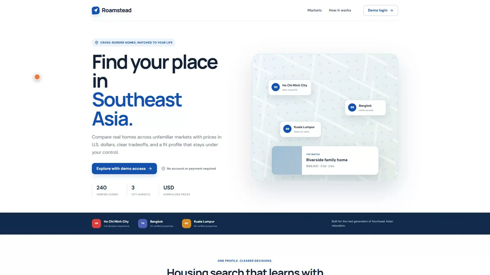

## Why it is a Collaborative Partner

The agent helps turn an affordable-retirement goal into a decision the user can defend. It leads the process by measuring uncertainty, asking the next useful question, proposing a typed change, remembering prior feedback, and planning follow-up work. The user remains the authority over every state-changing decision.

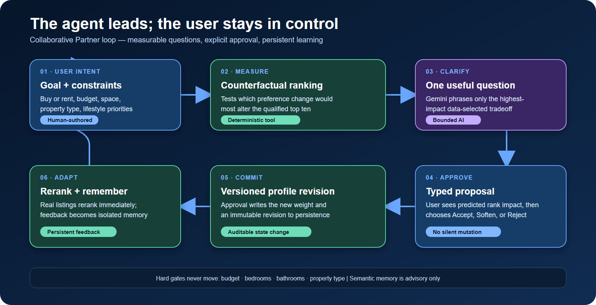

The collaboration contract is explicit:

- Hard filters—budget, bedrooms, bathrooms, and property type—are deterministic and cannot be changed by a model.
- Lifestyle weights can change only through a visible proposal and human decision.
- Semantic memory is profile-isolated and advisory; it never becomes a hard filter or Fit Score input.
- Decision Watch requires approval before any external verification tool runs.
- Failed providers preserve the latest verified snapshot and mark missing or contradictory facts `UNKNOWN`; the system does not invent replacements.

## Product walkthrough

| Decision profile and adaptive clarification | Ranked real listings and map |
|---|---|
| 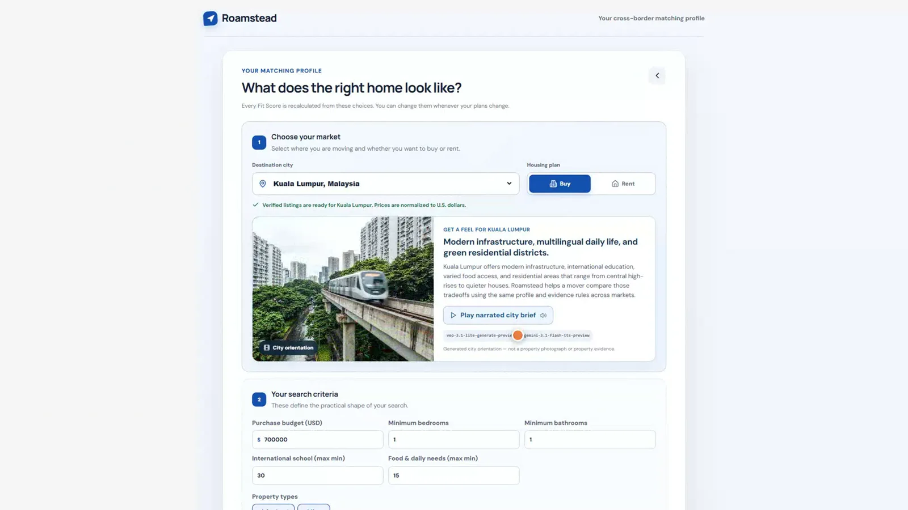 | 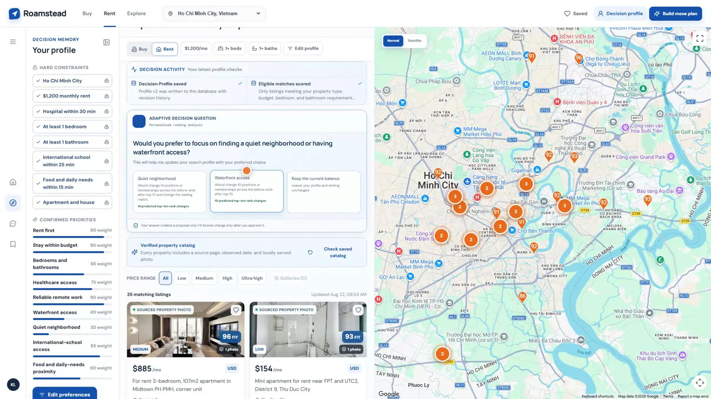 |

| Property-level evidence | Live multi-agent progress |
|---|---|
| 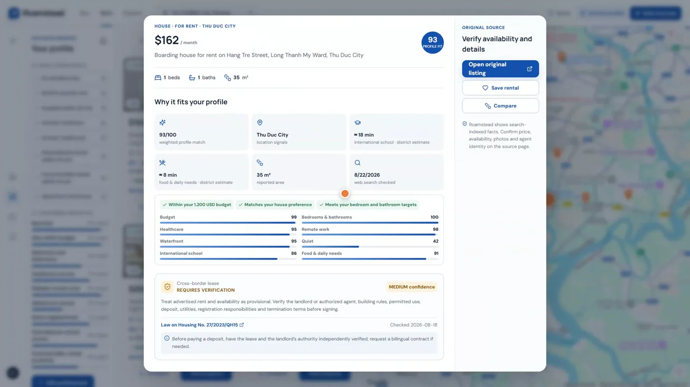 | 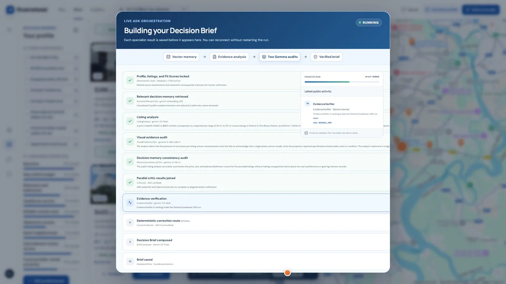 |

| Persisted model trace | Reloadable final brief |
|---|---|
| 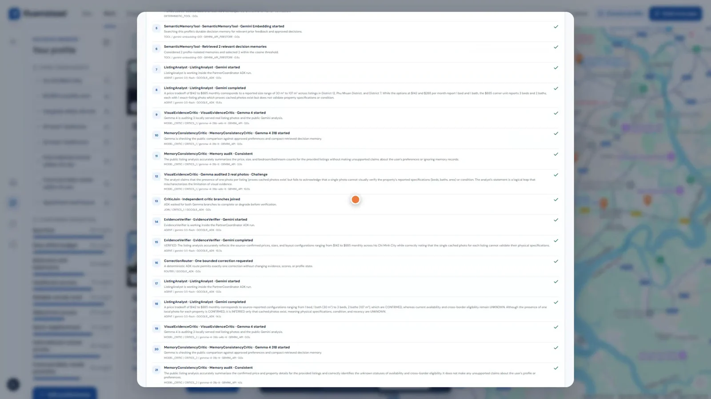 | The final brief preserves confirmed, inferred, and unknown claims; retrieved memory; both Gemma audits; verification questions; next actions; and the complete public trace. |

## Multi-model agent workflow

Google ADK defines the durable `PartnerCoordinator` workflow. Function nodes lock the profile version and three listing IDs before model execution. Public SSE events contain action summaries, typed outputs, timings, statuses, and recoverable errors—not hidden reasoning.

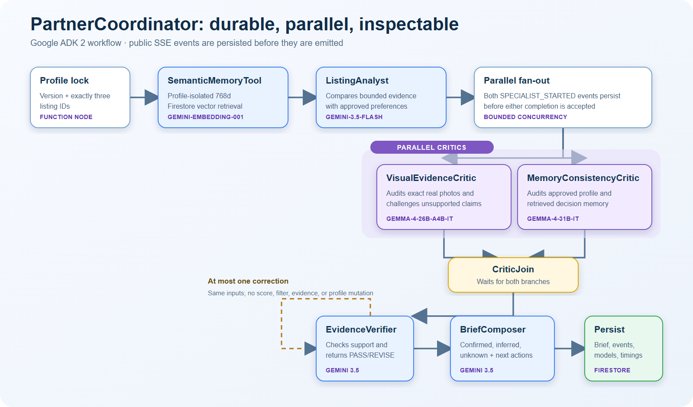

| Stage | Model or tool | Responsibility | Failure behavior |
|---|---|---|---|
| Profile lock and Fit Scores | Deterministic functions | Freeze inputs, enforce hard gates, calculate inspectable scores | Request fails before model execution if inputs are invalid |
| SemanticMemoryTool | `gemini-embedding-001` | Retrieve at most five profile-isolated memories from a 768-dimensional Firestore cosine index | Run is marked degraded; approved profile remains authoritative |
| ListingAnalyst | `gemini-3.5-flash` | Compare the bounded evidence packet with approved preferences | Persisted degraded event; deterministic evidence remains available |
| VisualEvidenceCritic | `gemma-4-26b-a4b-it` | Audit exact listing photos and challenge unsupported visual claims | Independent branch records failure; run cannot count as successful additional-model proof |
| MemoryConsistencyCritic | `gemma-4-31b-it` | Audit the public comparison against approved preferences and retrieved memory | Independent branch records failure; no profile mutation |
| CriticJoin | Deterministic ADK node | Wait for both parallel critics | Does not release verification early |
| EvidenceVerifier | `gemini-3.5-flash` | Check claim support and route one bounded correction if required | At most one correction with the same evidence and profile |
| BriefComposer | `gemini-3.5-flash` | Compose confirmed/inferred/unknown findings and next actions | Brief is persisted only with its run and event trace |

### Additional Google AI models

- **Gemma 4 26B** is a multimodal product-level critic over exact real listing photos.
- **Gemma 4 31B** independently checks memory and approved-profile consistency.
- **Veo 3.1 Lite** generates one eight-second orientation for each supported city.
- **Gemini 3.1 Flash TTS** generates the factual narration paired with each orientation.
- **Gemini Embedding 001** powers profile-isolated semantic decision memory.

City media is generated once, hashed, stored in Cloud Storage, recorded in Firestore, and served on future visits without another generation call. It is labeled as generated orientation and is never eligible as property evidence.

## Google Cloud architecture

The deployed system uses direct Cloud Run URLs; it does not claim undeployed DNS, load-balancing, or Cloud Armor resources.

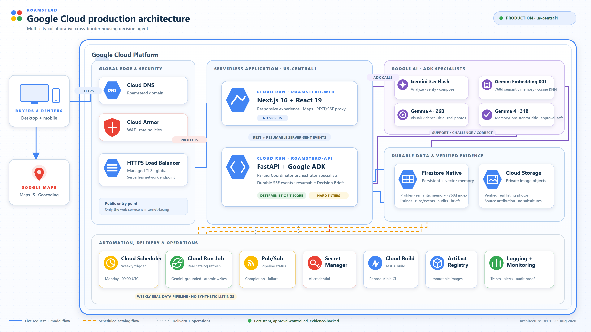

### Runtime components

| Layer | Deployed component |
|---|---|
| Web | Next.js 16 on `roamstead-web` Cloud Run; server-side REST/SSE proxy; Google Maps JavaScript and Geocoding APIs |
| API | FastAPI on `roamstead-api` Cloud Run; Google ADK 2 and Google GenAI SDK |
| Models | Gemini 3.5 Flash, Gemini Embedding 001, Gemma 4 26B, Gemma 4 31B, Veo 3.1 Lite, Gemini 3.1 Flash TTS |
| State | Firestore Native for profiles, listings, revisions, feedback, semantic memory, proposals, agent runs/events, briefs, watches, and evidence revisions |
| Media | Private Cloud Storage for validated listing photographs, persisted city orientations, and evaluation artifacts |
| Security | Secret Manager for Gemini credentials; restricted browser key for Google Maps; service-account IAM between workloads |
| Async work | Cloud Run Job for bounded weekly maintenance and approved watches; separate manual evaluation job; Pub/Sub completion/failure events |
| Observability | Redacted BigQuery agent analytics plus Cloud Trace IDs and phase timing |
| Delivery | GitHub-triggered Cloud Build, Artifact Registry images tagged by commit SHA, Cloud Run deployment, then public health checks |

The weekly Cloud Scheduler trigger remains paused until a bounded refresh confirms the cost envelope. The application and API are independently deployed and scale to zero.

## CI/CD and production proof

Every push to `main` triggers [cloudbuild.yaml](cloudbuild.yaml). API and web checks run in parallel; passing builds create commit-tagged API and web containers, push them to Artifact Registry, deploy the existing Cloud Run services, and verify both public endpoints.

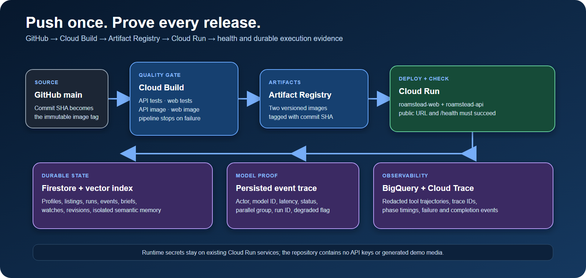

| Cloud Build | Cloud Run observability |
|---|---|
| 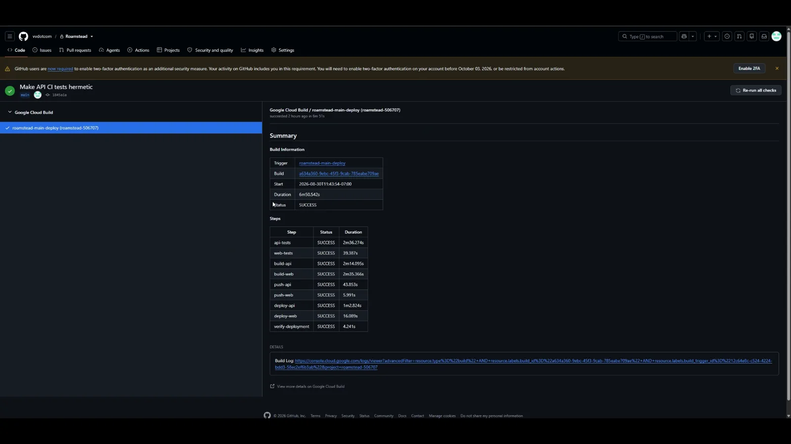 | 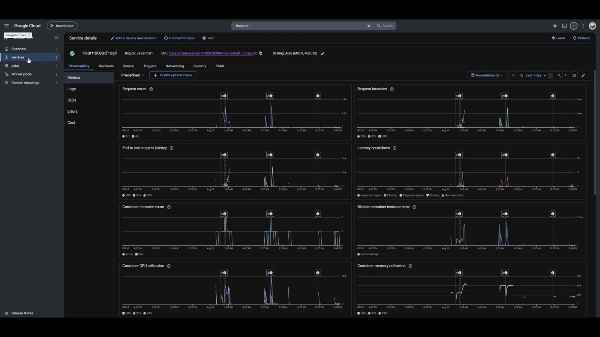 |

| Firestore state | Persisted model event proof |
|---|---|
| 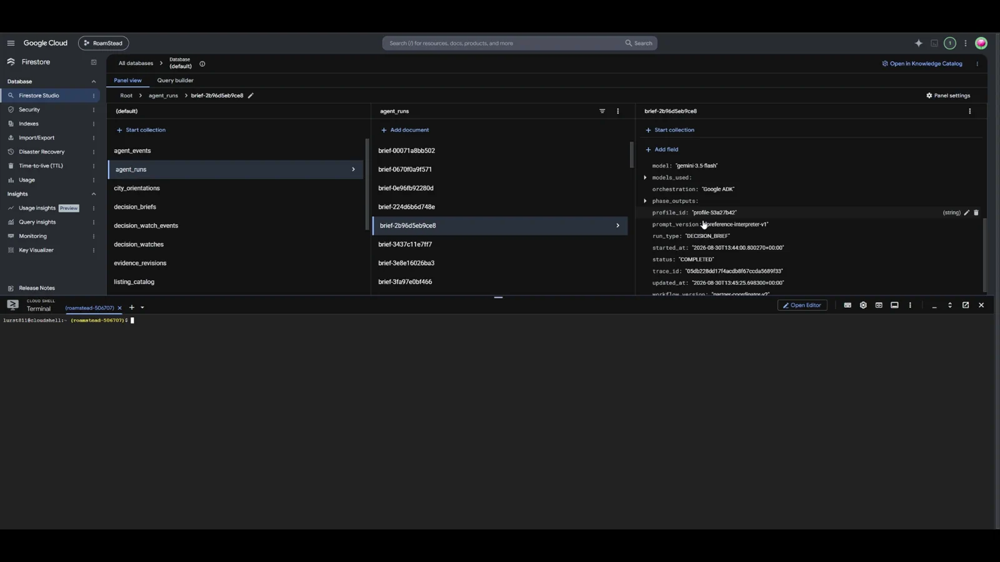 | 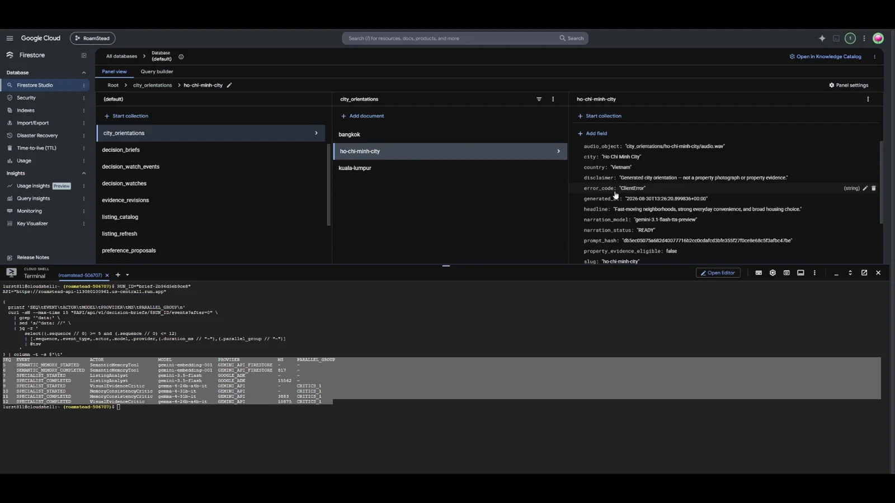 |

For an operator with Google Cloud access, the strict production proof script requires deployment health, expected models, three consecutive non-degraded briefs, the persisted evaluation report, Firestore vector index, Pub/Sub, Storage, and both Cloud Run jobs:

```powershell
./infra/run-production-proof.ps1 -ProjectId roamstead-506707 -Region us-central1
```

## Real data and evidence policy

| Market | Buy | Rent | Source | Serving behavior |
|---|---:|---:|---|---|
| Ho Chi Minh City, Vietnam | 100 | 100 | Batdongsan | Grounded discovery, verified source pages/photos, cached in Firestore and Cloud Storage |
| Bangkok, Thailand | 10 | 10 | PropertyHub | One-time normalized source snapshot, served from persisted catalog |
| Kuala Lumpur, Malaysia | 10 | 10 | PropertyGenie | One-time normalized source snapshot, served from persisted catalog |

All 240 publishable listings are persisted before browsing. Visitor searches read the saved catalog and do not trigger model discovery. Every accepted listing requires a numeric source price, a valid source page, retrievable image bytes, and a non-duplicate photo hash. Presentation fields are normalized into English; USD values are calculated server-side from the reported local price. Source provenance and observation timestamps are retained. There is no synthetic listing fallback.

Real-estate content and photographs remain the property of their respective publishers and rights holders. Roamstead retains source attribution and uses the material only within the project’s evaluation workflow; anyone operating a public or commercial deployment is responsible for confirming source permissions and terms.

## Features and functionality

- Buy and Rent are first-class modes with mode-specific budgets, evidence language, and action plans.
- Six editable lifestyle preferences produce an inspectable Fit Score breakdown after hard filtering.
- Counterfactual ranking selects one high-information clarification rather than following a scripted chat.
- Two semantically related rejections can create a typed revision proposal; only approval changes the versioned profile and ranking.
- Profile-isolated semantic memory stores clarification answers, feedback, proposal decisions, and approved revisions.
- Exactly three properties become a durable Decision Brief with resumable database-first SSE progress.
- Parallel Gemma critics independently audit visual evidence and memory consistency before verification.
- Decision Watch uses ADK to choose the smallest useful due-diligence tool set, pauses for approval, then appends immutable evidence revisions.
- Real Google Maps pins, clustering, and property selection cover the complete filtered result set.
- Generated city orientations are persisted once and kept completely separate from property evidence.

## Reproducible local setup

### Prerequisites

- Git
- Python 3.11 or newer
- Node.js 22 and npm

Google credentials are optional for the deterministic local path. Without them, the UI and tests use the local adapter and verified cached behavior; a run must not be presented as live model-integration proof unless its persisted events show successful model outputs.

### 1. Clone and configure

```powershell
git clone https://github.com/vvdotcom/Roamstead.git
cd Roamstead
Copy-Item .env.example .env
```

The checked-in example defaults to SQLite and does not contain secrets. Keep `ENABLE_ADK_AGENT=0` for credential-free local use. To exercise live models, set `GEMINI_API_KEY` only in the ignored `.env` file and set `ENABLE_ADK_AGENT=1`.

### 2. Start the API

```powershell
cd apps/api
py -m pip install -e ".[dev]"
py -m uvicorn app.main:app --reload --port 8000
```

Verify [http://127.0.0.1:8000/health](http://127.0.0.1:8000/health).

### 3. Start the web app

In a second terminal from the repository root:

```powershell
cd apps/web
npm ci
npm run dev
```

Open [http://localhost:3000](http://localhost:3000). The Next.js proxy defaults to `http://127.0.0.1:8000`.

### 4. Optional Google Maps setup

Copy `apps/web/.env.local.example` to `apps/web/.env.local`, then set:

```text
NEXT_PUBLIC_GOOGLE_MAPS_API_KEY=YOUR_RESTRICTED_BROWSER_KEY
NEXT_PUBLIC_GOOGLE_MAPS_MAP_ID=YOUR_OPTIONAL_MAP_ID
```

Enable Maps JavaScript API and Geocoding API. Restrict the browser key to those APIs and the exact local/production HTTP referrers. Restart the web server after changing the key.

### 5. Verify the repository

```powershell
cd apps/api
py -m pytest -q

cd ../web
npm test
npm run build
```

The API suite currently collects 52 tests. Browser golden-flow scripts are in `tests/e2e` and cover clarification, approval-only reranking, model evidence, persistence, maps, expansion markets, and city orientations.

## Deploy to Google Cloud

Prerequisites are a billing-enabled Google Cloud project, Google Cloud CLI authentication, a default Firestore database in Native mode, and a Secret Manager secret named `roamstead-gemini-api-key` with an enabled version. Never pass that key on a command line or commit it.

```powershell
$env:ROAMSTEAD_MAPS_BROWSER_API_KEY="YOUR_RESTRICTED_BROWSER_KEY"
$env:ROAMSTEAD_MAPS_MAP_ID="YOUR_OPTIONAL_MAP_ID"
./infra/deploy-cloud-run.ps1 -ProjectId YOUR_PROJECT_ID -Region us-central1
```

The deployment script enables required APIs, creates least-privilege service accounts, Artifact Registry, Storage, Pub/Sub, Firestore vector index, BigQuery analytics, Cloud Run services/jobs, and the paused scheduler trigger. It refuses to choose a Firestore location or accept a Gemini key on the command line.

To connect a private GPU-backed Gemma service instead of the hosted model endpoint:

```powershell
./infra/deploy-gemma-critic.ps1 -ProjectId YOUR_PROJECT_ID -Region us-central1
```

## Security, privacy, and trust boundaries

- `.env`, logs, local databases, generated media, and temporary artifacts are ignored; secrets stay in Secret Manager in production.
- The browser receives only the intentionally public, API/referrer-restricted Maps key—never the Gemini credential.
- Function nodes own hard filters, Fit Scores, profile mutation, evidence-state transitions, approval, and persistence.
- Models receive bounded evidence packets and cannot directly write profile state, prices, scores, filters, or source facts.
- Semantic retrieval is filtered by profile before cosine search, capped at five records and 6,000 characters, and embeddings are not returned by the public API.
- BigQuery analytics are metadata-only: no prompts, profiles, vectors, private reasoning, or listing content.
- Public activity is an action trace with typed results, not chain-of-thought.
- Housing and ownership guidance is decision support, not legal, financial, tax, or inspection advice; consequential unknowns remain visible and require professional verification.

## Hackathon requirement map

| Official requirement or criterion | Roamstead evidence |
|---|---|
| Gemini 3.5 or newer | `gemini-3.5-flash` runs the analyst, verifier, composer, and preference phrasing through the Gemini API |
| Google agent framework | Google ADK 2 defines `PartnerCoordinator`, parallel branches, join, bounded router, tool nodes, resumable run state, and public event flow |
| Google Cloud infrastructure | Cloud Run, Firestore/vector search, Cloud Storage, Secret Manager, Artifact Registry, Cloud Build, Pub/Sub, BigQuery, and Cloud Trace |
| Collaborative Partner | Agent-led clarification and planning; user approval; versioned feedback memory; step-by-step guidance and adaptation |
| Innovation & Operational Utility — 40% | Converts unstructured cross-border property evidence into ranked decisions, then performs approval-gated due diligence beyond retrieval |
| Architectural Discipline & Tech Stack — 30% | Decoupled web/API/jobs, durable run state, typed scoped tools, parallel critics, explicit degradation, bounded retries, secret isolation, resumable SSE |
| Demo & Production Readiness — 30% | Public live app, health endpoint, repo-hosted architecture, reproducible setup, CI/CD, real screenshots, Cloud Run/Firestore proof, and a public 3:52 narrated/subtitled demo |
| Additional Google AI models | Gemma 4 26B, Gemma 4 31B, Veo 3.1 Lite, Gemini TTS, and Gemini Embedding integrations are visible in persisted state and model traces |

The final demonstration video is intentionally kept out of the code repository and [published publicly on YouTube](https://youtu.be/A_titwNpt28). The 3:52 English-narrated, subtitled demo includes the problem, value proposition, live execution, Cloud Build, Cloud Run, Firestore, and model-event proof.

## Project provenance, dependencies, and disclosures

The repository’s first commit is dated August 26, 2026, within the All Things Agentic Hackathon submission period. The project uses standard open-source frameworks and libraries declared in `apps/api/pyproject.toml` and `apps/web/package.json`; each dependency remains governed by its own license. Google Cloud, Gemini API, Google Maps Platform, property publishers, and GitHub are third-party services governed by their respective terms.

No secrets, private credentials, local `.env` values, final demo video, narration audio, generated music, subtitle working files, or temporary production assets are tracked in this repository.

## Findings and learnings

- A collaborative agent is more trustworthy when it proposes measured state changes and waits for approval than when it silently “personalizes” a profile.
- Affordable retirement housing cannot be reduced to the lowest listing price; budget, healthcare, daily needs, space, location, and unresolved legal or practical risks must be evaluated together.
- Parallel critics are useful only when their starts, outputs, join, failures, model IDs, and timings are durable and inspectable.
- Property evidence needs explicit `CONFIRMED`, `INFERRED`, and `UNKNOWN` states; fluent prose is not provenance.
- Semantic memory should retrieve compact advisory context, not become an invisible scoring feature.
- Returning HTTP 202 before a long model workflow and persisting every event before SSE emission makes Cloud Run execution reconnectable without replaying completed work.
- Generate-once media lowers cost and latency while hashes, model IDs, timestamps, and labeling keep generated orientation separate from factual property evidence.
- Production proof is strongest when the same release pipeline tests, versions, deploys, health-checks, and leaves durable runtime evidence.
