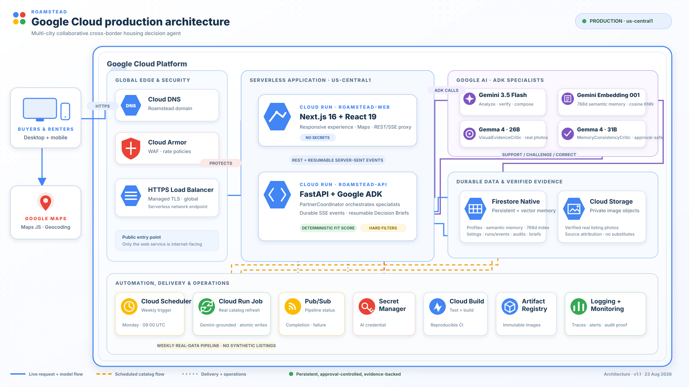

# Roamstead production architecture



The presentation-ready vector above models the production state. The editable Mermaid source is in [ROAMSTEAD_GCP_ARCHITECTURE_DIAGRAM.md](./ROAMSTEAD_GCP_ARCHITECTURE_DIAGRAM.md), and a 4K PNG export is available as [roamstead-google-cloud-architecture.png](./roamstead-google-cloud-architecture.png).

```text
Browser
  |
  +-- Google Maps JavaScript API + address geocoding
  |     (restricted browser key; 29-day coordinate cache)
  |
  +-- Cloud Run: roamstead-web (Next.js, no secrets)
  |       | /api rewrite
  |       v
  +-- Cloud Run: roamstead-api (FastAPI + Google ADK)
          |
          +-- Adaptive clarification
          |     CounterfactualRankingTool -> PreferenceInterpreter
          |     -> approval-only PreferenceProposal -> ProfileRevisionTool
          |
          +-- PartnerCoordinator ADK workflow
          |     SemanticMemoryTool (gemini-embedding-001, 768d)
          |              | profile-filtered Firestore cosine KNN
          |              v
          |     ListingAnalyst (Gemini 3.5)
          |              |
          |       parallel fan-out (max concurrency 3)
          |          /                         \
          |         v                           v
          |     VisualEvidenceCritic        MemoryConsistencyCritic
          |     (Gemma 4 26B + photos)      (Gemma 4 31B + memory)
          |          \                         /
          |           +---- CriticJoin --------+
          |                       |
          |                       v
          |     EvidenceVerifier (Gemini 3.5)
          |              |
          |       one bounded correction if CHALLENGE/REVISE
          |              |
          |              v
          |     BriefComposer (Gemini 3.5) -> database write
          |
          +-- deterministic FitScore, evidence, database, and revision tools
          +-- approval-gated Decision Watch
          |     DueDiligencePlanner (ADK) -> explicit approval
          |     -> bounded deterministic checks -> immutable EvidenceRevision
          +-- Firestore: profiles, clarifications, revisions, feedback,
          |              semantic_memory + 768d vector index,
          |              proposals, agent runs/events, listings, briefs,
          |              decision watches and evidence revisions
          +-- Cloud Storage: permissioned exact-listing photos
          |                    + generated city orientation video/audio
          +-- Secret Manager: Gemini credential
          +-- Pub/Sub: refresh completion/failure

Cloud Scheduler (weekly; PAUSED until bounded cost test passes)
  +-- Cloud Run Job: catalog refresh + approved Decision Watches
          +-- Gemini grounded search and English normalization
          +-- source/photo validation (no synthetic fallback)
          +-- atomic Firestore + Cloud Storage writes
```

The city selector has a separate, bounded media path: an operator-run administrative command calls `veo-3.1-lite-generate-preview` and `gemini-3.1-flash-tts-preview` once for each of three cities, uploads the results to the private Cloud Storage bucket, and writes model IDs, hashes, timestamps, and READY states to Firestore. Runtime page loads read those persisted assets only. They are visibly labeled as generated city orientation and are never eligible for property evidence.

SQLite is the local-development adapter and a process-local read cache in Cloud Run. With `PERSISTENCE_BACKEND=firestore`, cold instances hydrate records from Firestore and images from Cloud Storage. Provider failures preserve the latest verified snapshot and its timestamps.

The clarification is selected by measured counterfactual rank impact, not a hard-coded dialogue. Gemini may phrase the data-selected question, but cannot add options or mutate the profile. Decision Brief POST requests return HTTP 202 after persisting a queued run. The connected SSE request starts the workflow and tails durable events, keeping the Cloud Run request active while each specialist result appears live. Every event is written before emission; sequence IDs and phase checkpoints support reconnection without repeating completed model work. The public stream contains only action summaries, typed tool results, evidence states, and recoverable errors. It never exposes hidden reasoning.

Gemma 26B is a product-level visual critic, not a second text summary. It sees only deterministic listing evidence, public Gemini claims, and exact real photos already stored by Roamstead. Gemma 31B independently audits whether that public comparison is consistent with the approved profile and compact retrieved memory. Neither critic may mutate profile state, Fit Scores, filters, prices, or evidence. A model timeout or malformed response degrades the brief explicitly; only successful persisted typed outputs and a READY embedding packet count as model-integration proof.

Decision Watch is the consequential action beyond retrieval. ADK selects the smallest useful subset of source-availability, advertised-price, photo-evidence, currency-normalization, and proximity checks for exactly three shortlisted properties. The user sees and approves the typed plan before execution. Results append immutable before/after evidence revisions and an in-app notification; removed or contradictory information becomes `UNKNOWN`, and no replacement listing is invented.
