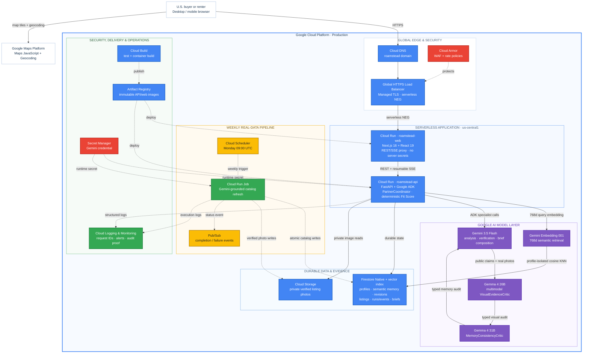

# Roamstead — Google Cloud Production Architecture

This diagram represents the production deployment described in `GOOGLE_CLOUD_DEPLOYMENT_PLAN.md`. It intentionally uses Firestore rather than Cloud SQL because Roamstead stores document-oriented decision memory, listings, and durable agent traces—not relational PostgreSQL data.

## Reading the diagram

- Solid blue paths are live user request and agent/model flows.
- Dashed paths are policies, deployment, secrets, scheduled work, persistence, and observability.
- The browser talks only to the public web edge and Google Maps Platform; Gemini, Firestore, Storage, and privileged credentials stay behind the FastAPI boundary.
- Fit Scores and hard filters remain deterministic. Gemini and Gemma interpret and verify evidence but do not alter prices, filters, or profile weights.
